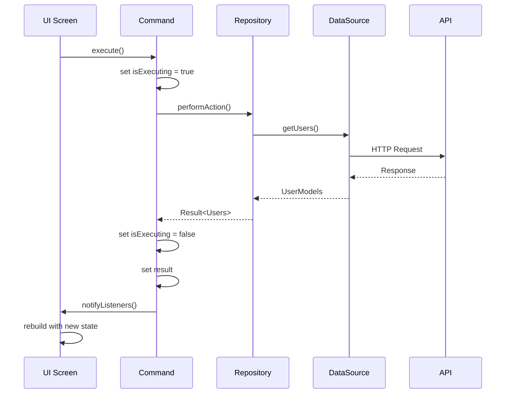

# Flutter Command Pattern + Riverpod Architecture

## 🏗️ Tổng quan kiến trúc

Đây là một kiến trúc enterprise-grade kết hợp **Command Pattern** với **Riverpod** để tạo ra một ứng dụng Flutter có khả năng mở rộng cao, dễ maintain và test.

## 🎯 Các layer chính

### 1. **Presentation Layer** 📱
- **Screens**: UI screens cho từng feature
- **Widgets**: Reusable UI components
- **Commands**: Encapsulate user actions
- **Providers**: Riverpod providers cho DI

### 2. **Domain Layer** 🏛️
- **Entities**: Core business objects
- **Repositories**: Abstract interfaces
- **Use Cases**: Business logic (có thể mở rộng)

### 3. **Data Layer** 💾
- **Models**: Data transfer objects
- **Repositories**: Concrete implementations
- **Data Sources**: API, Database, Cache

### 4. **Core Layer** 🔧
- **Commands**: Base command classes
- **Errors**: Failure handling
- **Network**: HTTP client setup
- **Utils**: Utilities và constants

## 🔄 Command Pattern Implementation

### Command Base Classes
```dart
abstract class Command<T> extends ChangeNotifier {
  // State management
  bool get isExecuting;
  bool get isSuccess; 
  bool get isFailure;
  T? get data;
  AppFailure? get failure;
  
  // Execution
  Future<void> execute();
  Future<Result<T>> performAction();
}
```

### Command Types
- **Command0**: Không có tham số
- **Command1**: Có 1 tham số
- **Command2**: Có 2 tham số

### Lợi ích của Command Pattern
1. **Tách biệt UI và Business Logic**
2. **Tự động quản lý states**
3. **Ngăn chặn duplicate executions**
4. **Consistent error handling**
5. **Dễ test và mock**

## 🔗 Riverpod Integration

### Provider Types
```dart
// Data source provider
final userRemoteDataSourceProvider = Provider<UserRemoteDataSource>((ref) {
  final dio = ref.read(dioProvider);
  return UserRemoteDataSourceImpl(dio);
});

// Repository provider
final userRepositoryProvider = Provider<UserRepository>((ref) {
  final dataSource = ref.read(userRemoteDataSourceProvider);
  return UserRepositoryImpl(dataSource);
});

// Command provider
final loadUsersCommandProvider = Provider<LoadUsersCommand>((ref) {
  return LoadUsersCommand(ref: ref);
});
```

### Dependency Injection Flow
```
Provider → Repository → DataSource → API
    ↓
Command → performAction() → Repository
    ↓
UI → ListenableBuilder → Command states
```

## 🎨 UI State Management

### Command State Listening
```dart
@override
Widget build(BuildContext context) {
  return ListenableBuilder(
    listenable: _command,
    builder: (context, child) {
      if (_command.isExecuting) {
        return LoadingWidget();
      }
      
      if (_command.isFailure) {
        return ErrorWidget(
          message: _command.failure!.userMessage,
          onRetry: () => _command.execute(),
        );
      }
      
      if (_command.isSuccess) {
        return SuccessWidget(data: _command.data);
      }
      
      return InitialWidget();
    },
  );
}
```

### Automatic State Updates
- **Loading**: Hiển thị loading indicator
- **Error**: Hiển thị error message với retry button
- **Success**: Hiển thị data
- **Initial**: Hiển thị initial state

## 📊 Data Flow



## 🚀 Advanced Features

### 1. Command Composition
```dart
class ComplexWorkflowCommand extends Command<bool> {
  final LoadDataCommand _loadCommand;
  final ProcessDataCommand _processCommand;
  final SaveDataCommand _saveCommand;
  
  @override
  Future<Result<bool>> performAction() async {
    // Chain commands with proper error handling
    await _loadCommand.execute();
    if (_loadCommand.isFailure) return Failure(_loadCommand.failure!);
    
    await _processCommand.executeWith(_loadCommand.data!);
    if (_processCommand.isFailure) return Failure(_processCommand.failure!);
    
    await _saveCommand.executeWith(_processCommand.data!);
    return _saveCommand.result!;
  }
}
```

### 2. Command Factory
```dart
class CommandFactory {
  final Ref ref;
  
  CommandFactory(this.ref);
  
  T createCommand<T extends Command>() {
    return switch (T) {
      LoadUsersCommand => LoadUsersCommand(ref: ref) as T,
      CreateUserCommand => CreateUserCommand(ref: ref) as T,
      UpdateUserCommand => UpdateUserCommand(ref: ref) as T,
      DeleteUserCommand => DeleteUserCommand(ref: ref) as T,
      _ => throw ArgumentError('Unknown command type: $T'),
    };
  }
}
```

### 3. Result Pattern
```dart
abstract class Result<T> {
  bool get isSuccess;
  bool get isFailure;
  T? get data;
  AppFailure? get failure;
  
  // Pattern matching
  R when<R>({
    required R Function(T data) success,
    required R Function(AppFailure failure) failure,
  });
}
```

## 🧪 Testing Strategy

### 1. Unit Tests
```dart
group('LoadUsersCommand', () {
  late MockUserRepository mockRepository;
  late LoadUsersCommand command;
  
  setUp(() {
    mockRepository = MockUserRepository();
    command = LoadUsersCommand(repository: mockRepository);
  });
  
  test('should load users successfully', () async {
    // Arrange
    when(mockRepository.getUsers()).thenAnswer(
      (_) async => Success([mockUser]),
    );
    
    // Act
    await command.execute();
    
    // Assert
    expect(command.isSuccess, true);
    expect(command.data, [mockUser]);
  });
});
```

### 2. Widget Tests
```dart
testWidgets('UserListScreen should show loading state', (tester) async {
  // Arrange
  final mockCommand = MockLoadUsersCommand();
  when(mockCommand.isExecuting).thenReturn(true);
  
  // Act
  await tester.pumpWidget(
    ProviderScope(
      overrides: [
        loadUsersCommandProvider.overrideWithValue(mockCommand),
      ],
      child: MaterialApp(home: UserListScreen()),
    ),
  );
  
  // Assert
  expect(find.byType(LoadingWidget), findsOneWidget);
});
```

### 3. Integration Tests
```dart
testWidgets('Complete user flow', (tester) async {
  // Test entire user journey from list to detail to edit
  await tester.pumpWidget(MyApp());
  
  // Tap on user item
  await tester.tap(find.byType(UserListItem).first);
  await tester.pumpAndSettle();
  
  // Verify detail screen
  expect(find.byType(UserDetailScreen), findsOneWidget);
  
  // Tap edit button
  await tester.tap(find.byIcon(Icons.edit));
  await tester.pumpAndSettle();
  
  // Verify form screen
  expect(find.byType(UserFormScreen), findsOneWidget);
});
```

## 📈 Performance Considerations

### 1. Memory Management
- Commands tự động dispose khi không sử dụng
- Listeners được remove trong dispose()
- Providers được cache bởi Riverpod

### 2. Network Optimization
- Dio interceptors cho logging và caching
- Request timeout configuration
- Retry mechanism cho failed requests

### 3. UI Performance
- ListenableBuilder chỉ rebuild khi cần thiết
- Proper widget keys cho list items
- Lazy loading cho large datasets

## 🔧 Configuration

### Environment Setup
```dart
class AppConfig {
  static const String baseUrl = String.fromEnvironment(
    'BASE_URL',
    defaultValue: 'https://jsonplaceholder.typicode.com',
  );
  
  static const bool enableLogging = bool.fromEnvironment(
    'ENABLE_LOGGING',
    defaultValue: true,
  );
}
```

### Flavors Support
```dart
enum Flavor { dev, staging, production }

class FlavorConfig {
  static Flavor get currentFlavor {
    return Flavor.values.firstWhere(
      (f) => f.name == const String.fromEnvironment('FLAVOR'),
      orElse: () => Flavor.dev,
    );
  }
}
```

## 🚀 Deployment

### Build Commands
```bash
# Development
flutter build apk --flavor dev -t lib/main_dev.dart

# Staging  
flutter build apk --flavor staging -t lib/main_staging.dart

# Production
flutter build apk --flavor production -t lib/main_production.dart
```

### CI/CD Pipeline
```yaml
# .github/workflows/ci.yml
name: CI/CD Pipeline

on:
  push:
    branches: [ main, develop ]
  pull_request:
    branches: [ main ]

jobs:
  test:
    runs-on: ubuntu-latest
    steps:
      - uses: actions/checkout@v3
      - uses: subosito/flutter-action@v2
      - run: flutter pub get
      - run: flutter test
      - run: flutter build apk
```

## 🎯 Best Practices

### 1. Command Design
- Một command chỉ làm một việc
- Sử dụng meaningful names
- Implement proper error handling
- Add logging cho debugging

### 2. State Management
- Không store UI state trong commands
- Sử dụng providers cho shared state
- Clear command results khi không cần

### 3. Error Handling
- Sử dụng typed failures
- Provide user-friendly messages
- Implement retry mechanisms
- Log errors cho monitoring

### 4. Testing
- Test business logic rigorously
- Mock external dependencies
- Test error scenarios
- Maintain high test coverage

## 🔮 Future Enhancements

### 1. Offline Support
- Implement caching layer
- Sync mechanism
- Offline queue for commands

### 2. Undo/Redo
- Command history
- Reversible operations
- User-friendly undo UI

### 3. Analytics
- Command execution tracking
- Performance metrics
- User behavior analysis

### 4. Monitoring
- Error tracking
- Performance monitoring
- Real-time dashboards

---

🚀 **Kiến trúc này cung cấp foundation mạnh mẽ cho việc xây dựng các ứng dụng Flutter enterprise-grade!** 🚀 