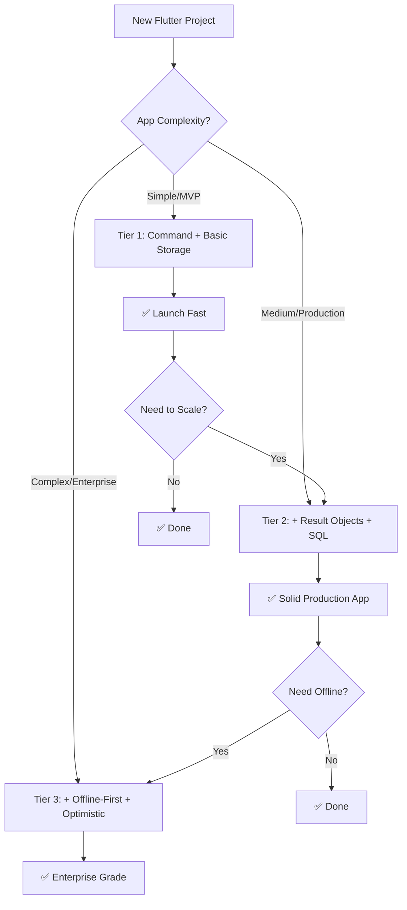

# 🎨 Flutter Design Patterns: Complete Guide

## 📚 Overview: Flutter Docs Patterns Analysis

Từ [Flutter Architecture Patterns](https://docs.flutter.dev/app-architecture/design-patterns), đây là **complete analysis** và **practical recommendations**:

---

## 🎯 Pattern Priority Matrix

### 🟢 **ALWAYS Implement** (Core patterns)
| Pattern | Why Essential | Implementation Effort |
|---------|--------------|----------------------|
| **Command Pattern** | Consistent state management | ⭐⭐⭐ Medium |
| **Persistent Storage** | Data survival | ⭐⭐ Easy |

### 🟡 **CONDITIONALLY Implement** (Based on needs)
| Pattern | When to Use | Complexity |
|---------|-------------|-----------|
| **Result Objects** | Complex error handling | ⭐⭐⭐⭐ High |
| **Offline-First** | Network-dependent apps | ⭐⭐⭐⭐⭐ Very High |
| **Optimistic State** | Better UX needed | ⭐⭐⭐ Medium |

---

## 📊 Detailed Pattern Analysis

### 1. 🎯 **Command Pattern** ✅ (Implemented)
```dart
// ✅ BENEFITS:
- Consistent state management
- Auto loading/error states  
- Scalable architecture
- Easy testing

// 🎯 VERDICT: ALWAYS USE
```

### 2. 💾 **Persistent Storage Architecture**
```dart
// 🎯 WHEN TO USE:
- User preferences
- Cache data
- Offline capability
- App state preservation

// 📝 IMPLEMENTATION LEVELS:

// Level 1: Key-Value (SharedPreferences)
class SettingsStorage {
  static const _prefs = 'app_prefs';
  
  Future<void> saveTheme(String theme) async {
    final prefs = await SharedPreferences.getInstance();
    await prefs.setString('theme', theme);
  }
  
  Future<String?> getTheme() async {
    final prefs = await SharedPreferences.getInstance();
    return prefs.getString('theme');
  }
}

// Level 2: SQL Database (SQLite)
class UserStorage {
  static Database? _database;
  
  Future<Database> get database async {
    _database ??= await _initDatabase();
    return _database!;
  }
  
  Future<void> insertUser(User user) async {
    final db = await database;
    await db.insert('users', user.toJson());
  }
  
  Future<List<User>> getUsers() async {
    final db = await database;
    final maps = await db.query('users');
    return maps.map((json) => User.fromJson(json)).toList();
  }
}

// 🎯 VERDICT: Use based on data complexity
// Simple data -> SharedPreferences
// Complex data -> SQLite/Hive
```

### 3. 🌐 **Offline-First Architecture**
```dart
// 🎯 WHEN TO USE:
- Social media apps
- E-commerce apps  
- Content consumption apps
- Areas with poor network

// 📝 IMPLEMENTATION:
class OfflineFirstUserService {
  final UserApiService _apiService;
  final UserCacheService _cacheService;
  final ConnectivityService _connectivity;
  
  Future<List<User>> getUsers() async {
    // Always try cache first
    final cachedUsers = await _cacheService.getUsers();
    
    if (await _connectivity.isConnected()) {
      try {
        // Fetch from API
        final apiUsers = await _apiService.getUsers();
        
        // Update cache
        await _cacheService.saveUsers(apiUsers);
        
        return apiUsers;
      } catch (e) {
        // Fallback to cache if API fails
        return cachedUsers;
      }
    } else {
      // Offline - use cache only
      return cachedUsers;
    }
  }
  
  Future<User> createUser(User user) async {
    if (await _connectivity.isConnected()) {
      // Online - send to API
      final createdUser = await _apiService.createUser(user);
      await _cacheService.addUser(createdUser);
      return createdUser;
    } else {
      // Offline - queue for later sync
      final pendingUser = user.copyWith(isPending: true);
      await _cacheService.addPendingUser(pendingUser);
      return pendingUser;
    }
  }
  
  // Sync when connection restored
  Future<void> syncPendingOperations() async {
    final pendingUsers = await _cacheService.getPendingUsers();
    
    for (final user in pendingUsers) {
      try {
        await _apiService.createUser(user);
        await _cacheService.removePendingUser(user.id);
      } catch (e) {
        // Keep in pending queue
        print('Sync failed for user ${user.id}');
      }
    }
  }
}

// 🎯 VERDICT: COMPLEX but POWERFUL
// Only for apps that REALLY need offline support
// High maintenance overhead
```

### 4. ⚡ **Optimistic State Updates**
```dart
// 🎯 WHEN TO USE:
- Social media likes/follows
- E-commerce cart actions
- Real-time collaborative apps
- Better perceived performance

// 📝 IMPLEMENTATION:
class OptimisticUserCommand extends Command<List<User>> {
  final UserService _userService;
  final List<User> _currentUsers;
  
  Future<void> deleteUserOptimistically(String userId) async {
    // 1. Update UI immediately (optimistic)
    final optimisticUsers = _currentUsers
        .where((user) => user.id != userId)
        .toList();
    
    _data = optimisticUsers;
    notifyListeners(); // UI updates instantly
    
    try {
      // 2. Send request to server
      await _userService.deleteUser(userId);
      
      // 3. Success - keep the optimistic state
      // No additional UI update needed
      
    } catch (e) {
      // 4. Failed - revert to original state
      _data = _currentUsers; // Restore original
      _errorMessage = 'Failed to delete user';
      notifyListeners(); // UI reverts
      
      // Show error to user
      _showUndoSnackBar();
    }
  }
  
  void _showUndoSnackBar() {
    // User-friendly error with undo option
    ScaffoldMessenger.of(context).showSnackBar(
      SnackBar(
        content: Text('Failed to delete user'),
        action: SnackBarAction(
          label: 'Undo',
          onPressed: () => _revertDeletion(),
        ),
      ),
    );
  }
}

// 🎯 VERDICT: GREAT for UX
// Use for non-critical actions
// Always have rollback mechanism
```

### 5. 🎁 **Result Objects for Error Handling**
```dart
// 🎯 WHEN TO USE:
- Complex error scenarios
- Need specific error handling
- Better user experience
- Type-safe error handling

// 📝 IMPLEMENTATION: (See DESIGN_PATTERNS_COMPARISON.md)

// 🎯 VERDICT: EXCELLENT for production apps
// Combines perfectly with Command Pattern
// Higher initial setup, long-term benefits
```

---

## 🏗️ **Recommended Architecture Stack**

### 🥇 **Tier 1: Minimum Viable Architecture**
```dart
// For: MVPs, Small apps, Learning projects
✅ Command Pattern
✅ Basic persistent storage (SharedPreferences)
✅ Simple error handling (try-catch)

// Result: Solid foundation, easy to maintain
```

### 🥈 **Tier 2: Production Ready**
```dart
// For: Production apps, Medium complexity
✅ Command Pattern
✅ Result Objects (enhanced error handling)
✅ SQL storage (SQLite/Hive)
✅ Basic offline support

// Result: Robust, scalable, good UX
```

### 🥉 **Tier 3: Enterprise Grade**
```dart
// For: Large apps, Complex requirements
✅ Command Pattern
✅ Result Objects
✅ Offline-First architecture
✅ Optimistic updates
✅ Advanced storage strategies
✅ State synchronization

// Result: Maximum performance & UX, high complexity
```

---

## 🎯 **Decision Tree**



---

## 💡 **Key Takeaways**

### ✅ **DO:**
1. **Start with Command Pattern** - Foundation cho mọi thứ
2. **Add patterns gradually** - Theo nhu cầu thực tế
3. **Measure before optimizing** - Don't over-engineer
4. **Keep it simple** - Complexity có cost

### ❌ **DON'T:**
1. **Implement all patterns at once** - Overkill
2. **Use patterns without reason** - Anti-pattern
3. **Copy-paste without understanding** - Technical debt
4. **Ignore team capacity** - Training overhead

### 🎯 **Golden Rule:**
> **"Solve today's problems with today's patterns.  
> Build foundation for tomorrow's growth."**

---

## 🚀 **Migration Strategy**

### Phase 1: Foundation (Week 1-2)
```dart
✅ Implement Command Pattern
✅ Basic error handling
✅ Simple storage (if needed)
```

### Phase 2: Enhancement (Week 3-4)
```dart
✅ Add Result Objects
✅ Improve error handling
✅ Better user feedback
```

### Phase 3: Optimization (Month 2)
```dart
✅ Offline capabilities (if needed)
✅ Optimistic updates (if beneficial)
✅ Performance optimizations
```

### Phase 4: Scale (Month 3+)
```dart
✅ Advanced patterns based on real usage
✅ Custom optimizations
✅ Team-specific patterns
```

**🎉 Result: Sustainable, scalable architecture that grows with your needs!** 