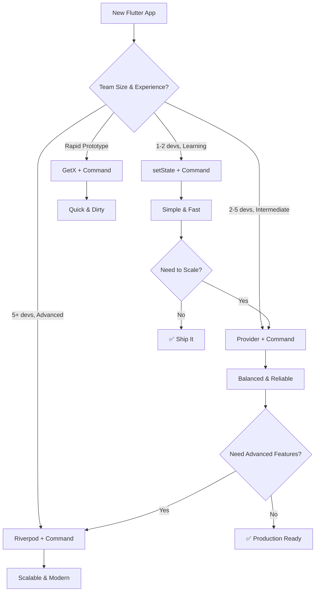

# 🚀 Flutter Tech Stack Recommendations 2025

## 🎯 Quick Decision Matrix

| App Type | State Management | Architecture | Error Handling | Storage | HTTP | Testing |
|----------|-----------------|--------------|----------------|---------|------|---------|
| **🎮 Simple/Learning** | setState | Command | try-catch | SharedPreferences | http | Basic unit tests |
| **📱 Production MVP** | Provider | MVVM + Command | Result Objects | SQLite | Dio | Unit + Widget |
 | **🏢 Enterprise** | Riverpod | MVVM + Command + Repository | Result Objects | SQLite + Hive | Dio + Retry | Full testing suite |
| **⚡ Rapid Prototype** | GetX | Command | try-catch | GetStorage | GetConnect | Minimal |

---

## 📊 Detailed Recommendations by App Category

### 🎮 **Simple Apps / Learning Projects**
> *Examples: Todo list, Calculator, Weather app*

#### Core Stack:
```yaml
state_management: setState + ListenableBuilder
architecture: Command Pattern only
error_handling: try-catch in Commands
storage: shared_preferences ^2.2.2
http: http ^1.1.0
dependency_injection: Manual injection
testing: flutter_test (built-in)
```

#### Example pubspec.yaml:
```yaml
dependencies:
  flutter:
    sdk: flutter
  shared_preferences: ^2.2.2
  http: ^1.1.0

dev_dependencies:
  flutter_test:
    sdk: flutter
  flutter_lints: ^3.0.1
```

#### Why this stack:
- ✅ **Minimal learning curve**
- ✅ **No additional complexity**
- ✅ **Fast development**
- ✅ **Easy debugging**

---

### 📱 **Production MVP Apps**
> *Examples: E-commerce, Social media, Booking apps*

#### Core Stack:
```yaml
state_management: flutter_riverpod ^2.4.9
architecture: MVVM + Command Pattern
error_handling: Result Objects + Custom Errors
storage: sqflite ^2.3.0 + shared_preferences ^2.2.2
http: dio ^5.4.0
dependency_injection: Riverpod providers
testing: flutter_test + mocktail ^1.0.1
routing: go_router ^12.1.3
```

#### Example pubspec.yaml:
```yaml
dependencies:
  flutter:
    sdk: flutter
  
  # State Management
  flutter_riverpod: ^2.4.9
  
  # HTTP & Networking
  dio: ^5.4.0
  
  # Storage
  sqflite: ^2.3.0
  shared_preferences: ^2.2.2
  
  # Navigation
  go_router: ^12.1.3
  
  # Utilities
  equatable: ^2.0.5
  freezed_annotation: ^2.4.1

dev_dependencies:
  flutter_test:
    sdk: flutter
  mocktail: ^1.0.1
  build_runner: ^2.4.7
  freezed: ^2.4.6
  json_annotation: ^4.8.1
  json_serializable: ^6.7.1
  flutter_lints: ^3.0.1
```

#### Architecture Overview:
```dart
// 📁 Project Structure
lib/
├── main.dart
├── app/
│   ├── router.dart
│   └── providers.dart
├── core/
│   ├── commands/
│   │   ├── command.dart
│   │   └── result.dart
│   ├── errors/
│   │   └── app_errors.dart
│   └── network/
│       └── dio_client.dart
├── features/
│   └── users/
│       ├── data/
│       │   ├── models/
│       │   ├── repositories/
│       │   └── datasources/
│       ├── domain/
│       │   ├── entities/
│       │   └── repositories/
│       └── presentation/
│           ├── screens/
│           ├── widgets/
│           └── commands/
└── shared/
    ├── widgets/
    └── utils/
```

---

### 🏢 **Enterprise / Large Scale Apps**
> *Examples: Banking, Healthcare, Complex business apps*

#### Core Stack:
```yaml
state_management: flutter_riverpod ^2.4.9
architecture: Clean Architecture + MVVM + Command + Repository
error_handling: Comprehensive Result Objects + Error Analytics
storage: sqflite ^2.3.0 + hive ^2.2.3 + secure_storage ^9.0.0
http: dio ^5.4.0 + retry ^3.1.2
dependency_injection: Riverpod + get_it ^7.6.4
testing: Full suite (Unit/Widget/Integration)
monitoring: firebase_crashlytics + sentry
```

#### Example pubspec.yaml:
```yaml
dependencies:
  flutter:
    sdk: flutter
  
  # State Management
  flutter_riverpod: ^2.4.9
  
  # HTTP & Networking
  dio: ^5.4.0
  retry: ^3.1.2
  connectivity_plus: ^5.0.2
  
  # Storage
  sqflite: ^2.3.0
  hive: ^2.2.3
  hive_flutter: ^1.1.0
  flutter_secure_storage: ^9.0.0
  shared_preferences: ^2.2.2
  
  # Navigation
  go_router: ^12.1.3
  
  # Dependency Injection
  get_it: ^7.6.4
  injectable: ^2.3.2
  
  # Error Handling & Monitoring
  firebase_crashlytics: ^3.4.8
  sentry_flutter: ^7.13.2
  
  # Code Generation
  freezed_annotation: ^2.4.1
  json_annotation: ^4.8.1
  injectable_annotation: ^2.3.2
  
  # UI & Utils
  flutter_screenutil: ^5.9.0
  cached_network_image: ^3.3.0
  shimmer: ^3.0.0
  
  # Local Authentication
  local_auth: ^2.1.7
  
  # Utilities
  equatable: ^2.0.5
  logger: ^2.0.2+1

dev_dependencies:
  flutter_test:
    sdk: flutter
  integration_test:
    sdk: flutter
  
  # Testing
  mocktail: ^1.0.1
  bloc_test: ^9.1.5
  
  # Code Generation
  build_runner: ^2.4.7
  freezed: ^2.4.6
  json_serializable: ^6.7.1
  injectable_generator: ^2.4.1
  
  # Analysis
  flutter_lints: ^3.0.1
  very_good_analysis: ^5.1.0
```

---

## 🎯 **Specific Recommendations**

### 1. 🏗️ **State Management Decision Tree**



### 2. 🎨 **Design Pattern Recommendations**

#### ✅ **ALWAYS Include:**
```dart
✅ MVVM Architecture
  - Separates UI from business logic
  - Testable and maintainable
  - Industry standard

✅ Command Pattern  
  - Consistent state management
  - Auto loading/error handling
  - Scalable business logic

✅ Repository Pattern (Medium+ apps)
  - Abstract data sources
  - Easy testing with mocks
  - Clean data layer
```

#### 🤔 **Consider Adding:**
```dart
🤔 Result Objects (Production+ apps)
  - Type-safe error handling
  - Better user experience
  - More complex but powerful

🤔 Factory Pattern (Complex apps)
  - Create objects dynamically
  - Useful for themes, configurations
  - Add when needed

❌ Singleton Pattern
  - Use DI instead
  - Better for testing
  - More flexible
```

### 3. 🛡️ **Error Handling Strategy**

#### 🎮 **Simple Apps:**
```dart
// Basic try-catch in Commands
class LoadUsersCommand extends Command<List<User>> {
  @override
  Future<List<User>> performAction() async {
    try {
      return await userService.getUsers();
    } catch (e) {
      throw Exception('Failed to load users: $e');
    }
  }
}
```

#### 📱 **Production Apps:**
```dart
// Result Objects with specific errors
sealed class Result<T> {}
class Success<T> extends Result<T> {
  final T data;
  Success(this.data);
}
class Failure<T> extends Result<T> {
  final AppError error;
  Failure(this.error);
}

// Custom error types
abstract class AppError {
  final String message;
  final String userMessage;
  const AppError(this.message, this.userMessage);
}

class NetworkError extends AppError {
  const NetworkError() : super(
    'Network connection failed',
    'Please check your internet connection'
  );
}
```

### 4. 💾 **Storage Strategy**

#### Decision Matrix:
| Data Type | Recommended Storage | Example |
|-----------|-------------------|---------|
| **Simple settings** | SharedPreferences | Theme, language |
| **Complex data** | SQLite | Users, products |
| **Sensitive data** | Secure Storage | Tokens, passwords |
| **Cache data** | Hive | API responses |
| **Large files** | File system | Images, documents |

### 5. 🌐 **HTTP Client Choice**

```dart
// Simple apps
http: ^1.1.0

// Production apps  
dio: ^5.4.0
  + Interceptors
  + Retry logic
  + Request/Response logging
  + Error handling

// Enterprise apps
dio: ^5.4.0
  + Retry package
  + Certificate pinning
  + Request queuing
  + Offline support
```

### 6. 🧪 **Testing Strategy**

#### 🎮 **Simple Apps:**
```dart
✅ Unit tests for Commands
✅ Basic widget tests
❌ Skip integration tests (overkill)
```

#### 📱 **Production Apps:**
```dart
✅ Unit tests (Commands, Services, Repositories)
✅ Widget tests (Key user flows)
✅ Integration tests (Happy path)
✅ Golden tests (UI consistency)
```

#### 🏢 **Enterprise Apps:**
```dart
✅ Comprehensive unit tests (90%+ coverage)
✅ Widget tests (All user flows)
✅ Integration tests (End-to-end scenarios)
✅ Golden tests (All screens)
✅ Performance tests
✅ Accessibility tests
```

---

## 🎯 **Step-by-Step Implementation Plan**

### Phase 1: Foundation (Week 1)
```dart
1. Setup project structure
2. Implement Command Pattern
3. Add basic state management
4. Setup HTTP client
5. Create first feature (Users CRUD)
```

### Phase 2: Core Features (Week 2-3)
```dart
1. Add storage layer
2. Implement error handling
3. Add navigation
4. Create main app features
5. Basic testing
```

### Phase 3: Polish (Week 4)
```dart
1. Improve error handling
2. Add loading states
3. Implement caching
4. Performance optimization
5. UI polish
```

### Phase 4: Production Ready (Week 5+)
```dart
1. Add monitoring/analytics
2. Comprehensive testing
3. Security hardening
4. Performance profiling
5. CI/CD setup
```

---

## 💡 **Additional Considerations**

### 🎨 **UI/UX Libraries:**
```yaml
# Essential UI
flutter_screenutil: ^5.9.0  # Responsive design
cached_network_image: ^3.3.0  # Image caching
shimmer: ^3.0.0  # Loading animations

# Advanced UI
lottie: ^2.7.0  # Animations
flutter_staggered_grid_view: ^0.6.2  # Advanced layouts
photo_view: ^0.14.0  # Image viewer
```

### 🔐 **Security:**
```yaml
# Essential Security
flutter_secure_storage: ^9.0.0  # Secure storage
local_auth: ^2.1.7  # Biometric auth

# Advanced Security
cryptography: ^2.5.0  # Encryption
certificate_pinning: ^3.0.1  # Network security
```

### 📊 **Analytics & Monitoring:**
```yaml
# Essential Monitoring
firebase_crashlytics: ^3.4.8  # Crash reporting
firebase_analytics: ^10.7.4  # User analytics

# Advanced Monitoring  
sentry_flutter: ^7.13.2  # Performance monitoring
firebase_performance: ^0.9.3+8  # Performance metrics
```

---

## 🎉 **Final Recommendations**

### 🏆 **Recommended Stack for Most Apps:**
```yaml
✅ Riverpod (State Management)
✅ MVVM + Command Pattern (Architecture)  
✅ Result Objects (Error Handling)
✅ SQLite + SharedPreferences (Storage)
✅ Dio (HTTP Client)
✅ Go Router (Navigation)
✅ Comprehensive Testing
```

### 🎯 **Success Metrics:**
- **Development Speed:** How fast can you build features?
- **Code Quality:** How maintainable is your code?
- **Team Productivity:** How easy is onboarding?
- **User Experience:** How smooth is the app?
- **Scalability:** How well does it handle growth?

### 📚 **Learning Path:**
1. **Start simple:** setState + Command
2. **Add complexity gradually:** Provider → Riverpod
3. **Enhance error handling:** try-catch → Result Objects
4. **Scale architecture:** Basic → Clean Architecture
5. **Add advanced features:** Offline, sync, etc.

**🚀 Remember: Start with what you need today, build foundation for tomorrow's growth!** 