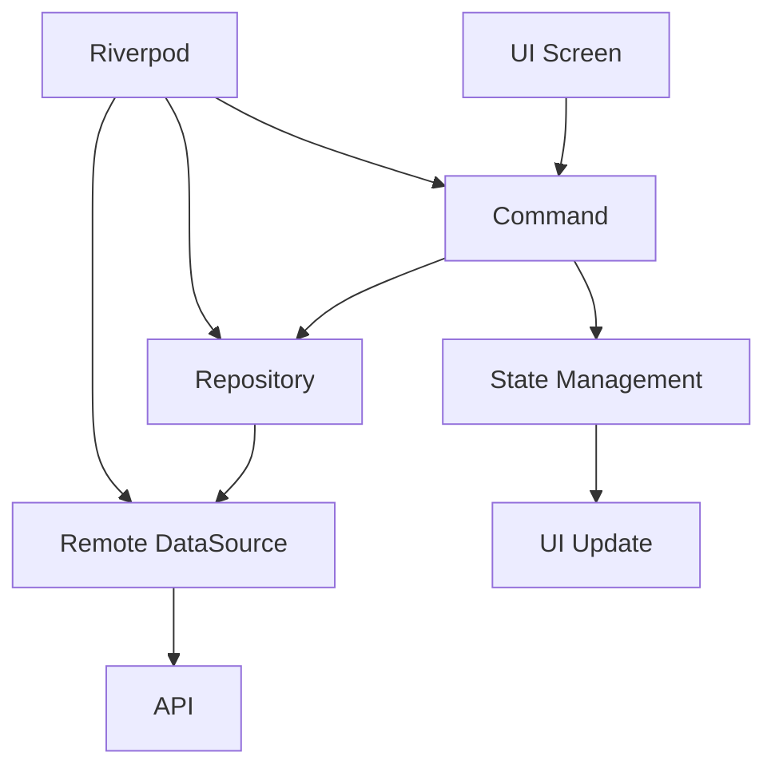

# Flutter Command Pattern + Riverpod Project

## 📖 Tổng quan

Đây là một Flutter project demo về cách kết hợp **Command Design Pattern** với **Riverpod** để tạo ra một kiến trúc sạch, scalable và maintainable.

## 🏗️ Cấu trúc thư mục

```
lib/
├── app/
│   └── app.dart                      # App configuration
├── core/
│   ├── commands/
│   │   └── command.dart              # Base Command classes
│   ├── constants/
│   │   └── app_constants.dart        # App constants
│   ├── errors/
│   │   └── failures.dart             # Error/Failure classes
│   ├── network/
│   │   └── dio_provider.dart         # Dio network provider
│   └── utils/
│       └── logger.dart               # Logger utility
└── features/
    └── user_management/
        ├── data/
        │   ├── datasources/
        │   │   └── user_remote_datasource.dart
        │   ├── models/
        │   │   └── user_model.dart
        │   └── repositories/
        │       └── user_repository_impl.dart
        ├── domain/
        │   ├── entities/
        │   │   └── user_simple.dart
        │   └── repositories/
        │       └── user_repository.dart
        └── presentation/
            ├── commands/
            │   └── user_commands.dart
            ├── providers/
            │   └── user_providers.dart
            ├── screens/
            │   ├── user_detail_screen.dart
            │   ├── user_form_screen.dart
            │   └── user_list_screen.dart
            └── widgets/
                ├── empty_widget.dart
                ├── error_widget.dart
                ├── loading_widget.dart
                └── user_list_item.dart
```

## 🚀 Tính năng chính

### ✅ Command Pattern
- **Encapsulation**: Đóng gói các action thành objects
- **State Management**: Tự động quản lý `running`, `error`, `success` states
- **Error Handling**: Xử lý lỗi nhất quán
- **Duplicate Prevention**: Ngăn chặn multiple executions

### ✅ Riverpod Integration
- **Dependency Injection**: Quản lý dependencies một cách clean
- **Provider Pattern**: State management với providers
- **Reactive Programming**: UI tự động cập nhật khi state thay đổi

### ✅ Clean Architecture
- **Separation of Concerns**: Tách biệt Data, Domain, Presentation layers
- **SOLID Principles**: Tuân thủ các nguyên tắc SOLID
- **Testability**: Dễ dàng unit test và integration test

## 🔧 Cách sử dụng

### 1. Cài đặt dependencies
```bash
flutter pub get
```

### 2. Chạy ứng dụng
```bash
flutter run
```

### 3. Build APK
```bash
flutter build apk
```

## 💡 Kiến trúc Command Pattern

### Command Base Classes
```dart
abstract class Command<T> extends ChangeNotifier {
  bool get isExecuting;
  bool get isSuccess;
  bool get isFailure;
  T? get data;
  AppFailure? get failure;
  
  Future<void> execute();
  Future<Result<T>> performAction();
}
```

### Sử dụng Command trong UI
```dart
class UserListScreen extends ConsumerStatefulWidget {
  // ...
  
  @override
  void initState() {
    super.initState();
    _loadUsersCommand = ref.read(loadUsersCommandProvider);
    _loadUsersCommand.addListener(_handleResult);
    _loadUsersCommand.execute();
  }
  
  Widget build(BuildContext context) {
    return ListenableBuilder(
      listenable: _loadUsersCommand,
      builder: (context, child) {
        if (_loadUsersCommand.isExecuting) {
          return LoadingWidget();
        }
        if (_loadUsersCommand.isFailure) {
          return ErrorWidget(error: _loadUsersCommand.failure);
        }
        return UserList(users: _loadUsersCommand.data);
      },
    );
  }
}
```

## 🔄 Data Flow



## 🎯 Lợi ích

### 1. **Tách biệt concerns**
- UI chỉ trigger commands
- Business logic trong commands
- Data handling trong repositories

### 2. **Automatic State Management**
- Loading states
- Error handling
- Success states
- Prevent duplicate actions

### 3. **Scalability**
- Easy to add new features
- Clean code structure
- Maintainable codebase

### 4. **Testability**
- Mock commands easily
- Unit test business logic
- Integration test workflows

## 🧪 Testing

### Unit Tests
```dart
test('LoadUsersCommand should load users successfully', () async {
  // Arrange
  final mockRepository = MockUserRepository();
  final command = LoadUsersCommand(repository: mockRepository);
  
  when(mockRepository.getUsers()).thenAnswer(
    (_) async => Success([mockUser]),
  );
  
  // Act
  await command.execute();
  
  // Assert
  expect(command.isSuccess, true);
  expect(command.data, [mockUser]);
});
```

### Widget Tests
```dart
testWidgets('UserListScreen should show loading state', (tester) async {
  // Arrange
  final mockCommand = MockLoadUsersCommand();
  when(mockCommand.isExecuting).thenReturn(true);
  
  // Act
  await tester.pumpWidget(
    ProviderScope(
      overrides: [
        loadUsersCommandProvider.overrideWithValue(mockCommand),
      ],
      child: UserListScreen(),
    ),
  );
  
  // Assert
  expect(find.byType(LoadingWidget), findsOneWidget);
});
```

## 📚 Patterns Used

### 1. **Command Pattern**
- Encapsulates requests as objects
- Supports undo/redo operations
- Decouples sender from receiver

### 2. **Repository Pattern**
- Abstracts data access
- Centralized data logic
- Easy to test and mock

### 3. **Provider Pattern (Riverpod)**
- Dependency injection
- State management
- Reactive programming

### 4. **Observer Pattern**
- Commands notify listeners
- UI reacts to state changes
- Loose coupling

## 🚀 Advanced Features

### Command Composition
```dart
class ComplexWorkflowCommand extends Command<bool> {
  final LoadDataCommand _loadCommand;
  final ProcessDataCommand _processCommand;
  final SaveDataCommand _saveCommand;
  
  @override
  Future<Result<bool>> performAction() async {
    await _loadCommand.execute();
    if (_loadCommand.isFailure) return Failure(_loadCommand.failure!);
    
    await _processCommand.executeWith(_loadCommand.data!);
    if (_processCommand.isFailure) return Failure(_processCommand.failure!);
    
    await _saveCommand.executeWith(_processCommand.data!);
    if (_saveCommand.isFailure) return Failure(_saveCommand.failure!);
    
    return Success(true);
  }
}
```

### Command Factory
```dart
class CommandFactory {
  final Ref ref;
  
  CommandFactory(this.ref);
  
  T createCommand<T extends Command>() {
    switch (T) {
      case LoadUsersCommand:
        return LoadUsersCommand(ref: ref) as T;
      case CreateUserCommand:
        return CreateUserCommand(ref: ref) as T;
      default:
        throw ArgumentError('Unknown command type: $T');
    }
  }
}
```

## 🔧 Configuration

### Dio Configuration
```dart
final dioProvider = Provider<Dio>((ref) {
  final dio = Dio();
  dio.options = BaseOptions(
    baseUrl: AppConstants.baseUrl,
    connectTimeout: AppConstants.connectTimeout,
    receiveTimeout: AppConstants.receiveTimeout,
  );
  return dio;
});
```

### Logger Configuration
```dart
class AppLogger {
  static Logger get logger => _logger;
  
  static void init() {
    _logger = Logger(
      printer: PrettyPrinter(
        methodCount: 2,
        errorMethodCount: 8,
        printTime: true,
      ),
    );
  }
}
```

## 📋 TODO

- [ ] Add integration tests
- [ ] Implement caching layer
- [ ] Add offline support
- [ ] Implement undo/redo functionality
- [ ] Add performance monitoring
- [ ] Implement analytics tracking

## 🤝 Contributing

1. Fork the repository
2. Create your feature branch (`git checkout -b feature/amazing-feature`)
3. Commit your changes (`git commit -m 'Add some amazing feature'`)
4. Push to the branch (`git push origin feature/amazing-feature`)
5. Open a Pull Request

## 📄 License

This project is licensed under the MIT License - see the [LICENSE](LICENSE) file for details.

## 🙏 Acknowledgments

- Flutter team for the amazing framework
- Riverpod team for the excellent state management solution
- Community for inspiration and best practices

---

⭐ **Happy Coding!** ⭐ 