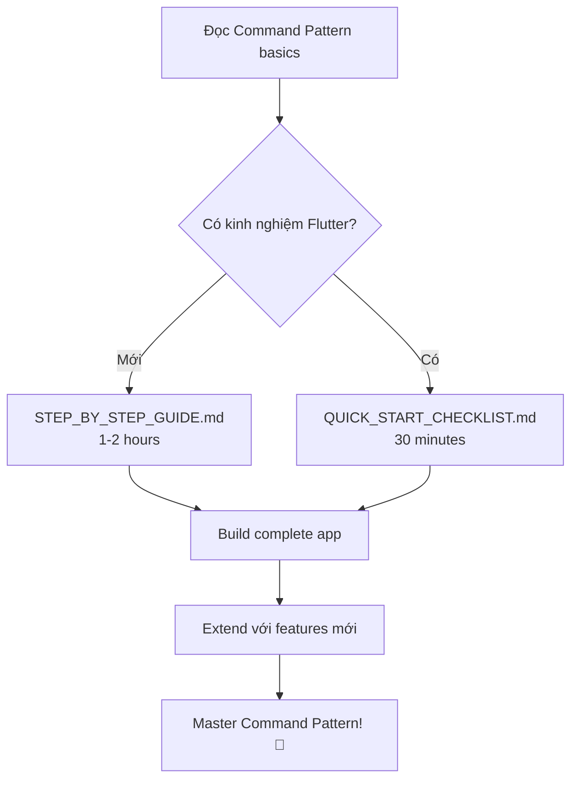

# 📚 Implementation Guides Overview

Tôi đã tạo **2 guides chính** để giúp developer mới implement Command Pattern + Riverpod:

## 📖 1. STEP_BY_STEP_GUIDE.md
**📍 Dành cho:** Developer muốn hiểu chi tiết từng bước  
**⏱️ Thời gian:** 1-2 giờ  
**📄 Nội dung:** 740 lines, 7 phases

### Các Phase chính:
- **PHASE 1:** Project Setup (dependencies, folder structure)
- **PHASE 2:** Core Infrastructure (Command base classes)  
- **PHASE 3:** Data Layer (models, services)
- **PHASE 4:** Command Implementations (3 commands với chỉ 4 lines/command)
- **PHASE 5:** UI Implementation (complete screen với auto states)
- **PHASE 6:** Testing & Debugging
- **PHASE 7:** Adding New Features (mở rộng)

### Highlights:
✅ **Complete working app** với CRUD operations  
✅ **Detailed explanations** cho từng đoạn code  
✅ **Error handling & debugging** common issues  
✅ **Extension examples** để scale app  

---

## ⚡ 2. QUICK_START_CHECKLIST.md  
**📍 Dành cho:** Developer muốn implement nhanh  
**⏱️ Thời gian:** 30 phút  
**📄 Nội dung:** Checklist format, copy-paste code

### Quick Phases:
- **5 phút:** Setup project + dependencies
- **10 phút:** Core Command classes + Models  
- **10 phút:** Service + Commands implementation
- **5 phút:** UI Screen với auto states

### Highlights:
✅ **Copy-paste ready** code blocks  
✅ **Minimal viable app** trong 30 phút  
✅ **Extension steps** để thêm features  
✅ **Key takeaways** summary  

---

## 🎯 Khuyến nghị sử dụng:

### 👶 Developer mới với Flutter/Riverpod:
→ **Bắt đầu với STEP_BY_STEP_GUIDE.md**
- Đọc hiểu từng step  
- Copy code từng phần nhỏ
- Test từng phase

### 🚀 Developer có kinh nghiệm:  
→ **Sử dụng QUICK_START_CHECKLIST.md**
- Fast prototype trong 30 phút
- Mở rộng features theo nhu cầu
- Reference STEP_BY_STEP khi cần chi tiết

---

## 🔗 Flow học tập đề xuất:



---

## 📁 Project Structure Result:

Sau khi hoàn thành guides, bạn sẽ có:

```
my_command_app/
├── lib/
│   ├── main.dart                    # App entry point
│   ├── core/
│   │   ├── commands/
│   │   │   └── command.dart        # Base Command classes (setup once)
│   │   ├── network/
│   │   │   └── dio_provider.dart   # HTTP client setup
│   │   └── constants/
│   │       └── app_constants.dart  # App-wide constants
│   ├── models/
│   │   └── user.dart               # Data models
│   ├── services/
│   │   └── user_service.dart       # API calls
│   ├── commands/
│   │   └── user_commands.dart      # Feature commands (4 lines each!)
│   └── screens/
│       └── user_list_screen.dart   # UI with auto states
```

## ✨ Key Benefits After Implementation:

### 🎯 Developer Experience:
- **Zero setState()** calls needed
- **Auto loading/error** states  
- **Consistent behavior** across app
- **Easy to test** và maintain

### 🚀 Productivity Boost:
- **Setup once, use forever** pattern
- **New features = 4-6 lines** of code
- **Scale without complexity** increase
- **Team consistency** guaranteed

### 📈 Code Quality:
- **Clean separation** of concerns
- **Reusable components** 
- **Predictable behavior**
- **Enterprise-ready** architecture

---

## 🤝 Next Steps After Completing:

1. **Practice:** Implement 2-3 more features using Commands
2. **Explore:** Add offline support, caching, animations  
3. **Scale:** Apply pattern to real projects
4. **Share:** Teach teammates this approach

**🎯 Goal Achieved: From 0 to Command Pattern Master in < 2 hours!** 